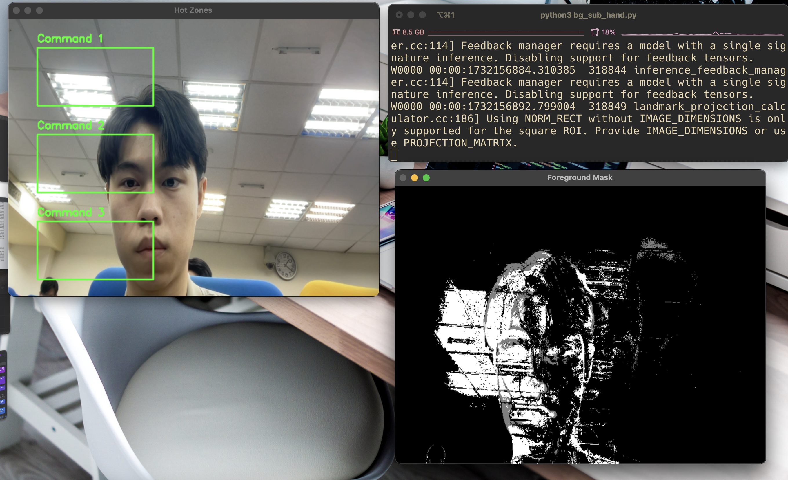
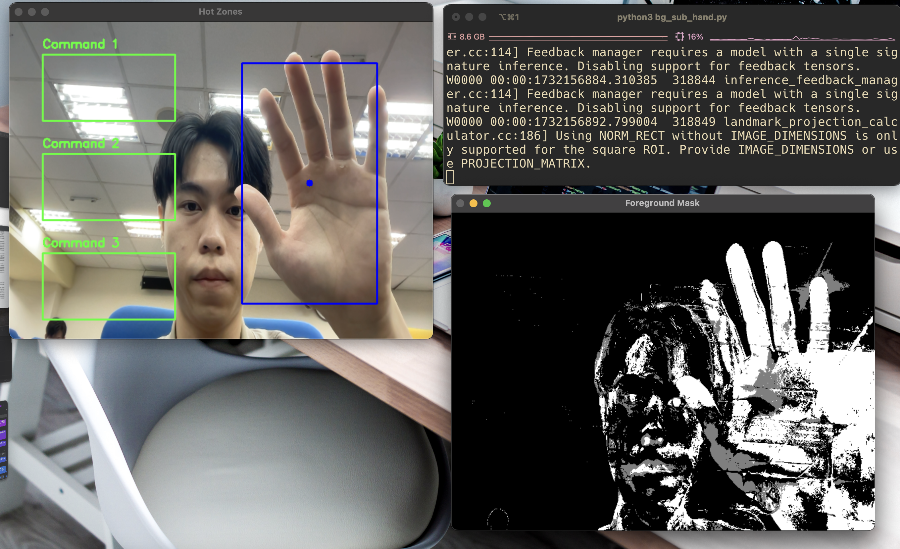
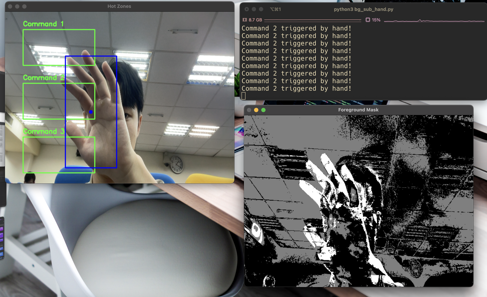

[Github link](https://github.com/mao-code/background_substraction)
# Demo
## Background Substraction
Our threshold: ```motion_threshold = 5000```
Below is the simple background substraction demonstration and the event triggered:

<div>Before(static):</div>


<div>After(moving):</div>


<div>Triggered Events:</div>


## Background Substraction w/ hand detection

<div>Before:</div>



<div>After:</div>


# Main Idea
$$ \text{Image}_t - \text{Image}_{t-1} > \text{threshold} $$

# References
* [Background Substraction](https://medium.com/@muhammadsabih56/background-subtraction-in-computer-vision-402ddc79cb1b)